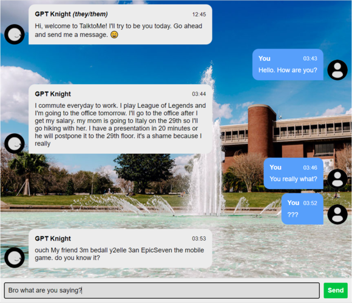

# TalkToMe

<p align="center">
  
</p>

__Talk to a person based on a Transformer model of them.__

This application scrapes chat logs between two users from Discord and inputs one of the user's data through a GPT-2-medium model to generate a relatively complex language model. The dataset, found under ```training_2_.txt```, contains 300 lines of conversation between Mykola and Steven, two friends from UCF. Because the training data is multilingual, GPT-2 can still adapt to these changes and generate fairly reasonable text. For training, we use the gpt-2-simple library and fine tune the model to our own data. 

## Web Application Used
We utilize Python's Flask as our backend to receive user's input text. It passes it through the GPT-2 model to retrieve the output and forwards to the front-end UI. The front-end was inspired by this [project](https://github.com/huzaifsayed/coronabot-chatterbot) and we use his front-end, developed with HTML, CSS and JavaScript as our template. 

## Link to Model:
The model that we trained can be found [here](https://drive.google.com/drive/folders/11kEUhx_rDGYdn9bdaiJ_kUfwqi1T9O9_?usp=sharing)


## Running Web Application
1. `cd web_app`
2. `pip install -r requirements.txt`
3. `python app.py`
4. Type `localhost:5000` in your favorite browser and you're ready to go! _Express yourself to yourself!_

